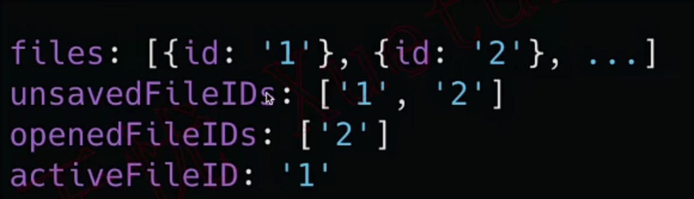
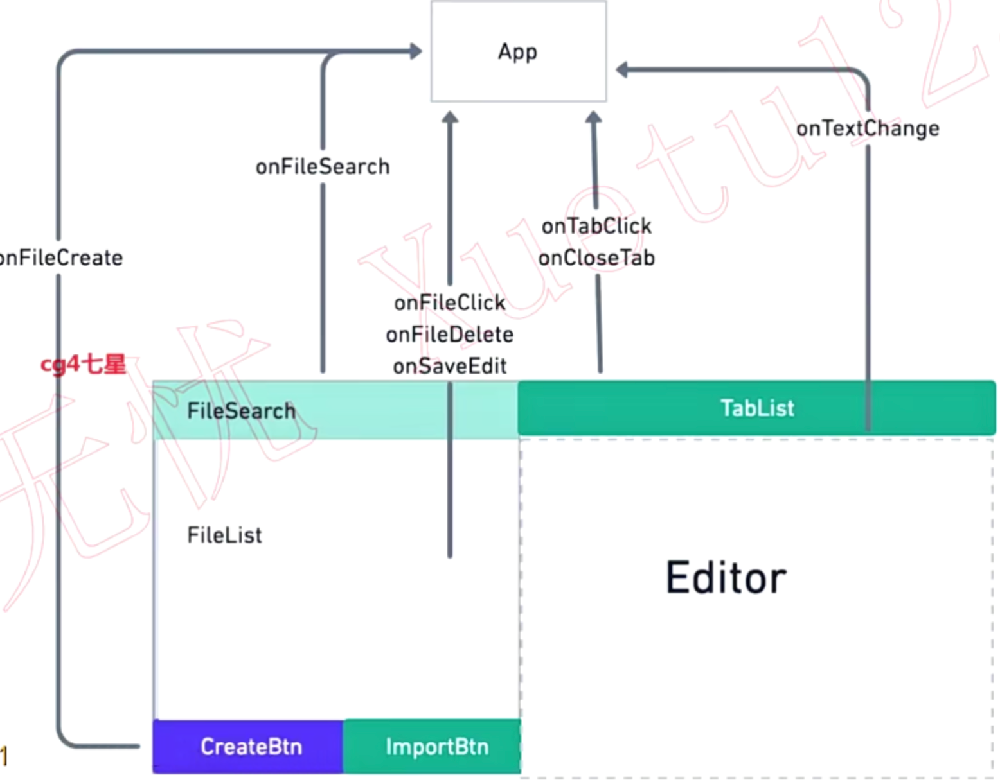

# Markdown 项目

## election

### 下载项

1. election [官网](https://www.electronjs.org/zh/)

   ```
   npm install --save-dev electron@latest
   ```

   安装完毕后使用 npm start 运行项目，本质是桌面端浏览器

2. nodemon

   自动监听文件变化，自动运行命令

   ```
   npm install nodemon --save-dev
   ```

3. remote

   ```
   npm install --save @electron/remote
   ```

---

### 创建第一个窗口

在项目下 main.js 新建窗口，electron 本质就是个浏览器

```js
const { app, BrowserWindow } = require('electron')

// 创建窗口
function createWindow() {
    const win = new BrowserWindow({
        width: 800,
        height: 600
    })
    win.loadFile('index.html')			// 加载文件
    win.webContents.openDevTools()		// 加载开发者工具，相当于浏览器开F12
}
app.on('ready', () => {
    createWindow()
})
```

---

### 创建子窗口

```js
const { app, BrowserWindow } = require('electron')

function createWindow() {
    const win = new BrowserWindow({
        width: 850,
        height: 600
    })
    win.loadFile('index.html')
    win.webContents.openDevTools()
    return win
}
// 创建子窗口，把父窗口作为参数传入
function createAnotherWindow(parent) {
    const win = new BrowserWindow({
        width: 600,
        height: 300,
        parent						// parent 代表窗口的父节点
    })
    win.loadFile('second.html')
}
app.on('ready', () => {
    const parent = createWindow()
    createAnotherWindow(parent)
})
```

---

### 进程间通信（单向、双向）

每一个 tab 都是一个**独立的进程**，有一个 main 进程，控制整个程序。进程间的通信使用 preload 脚本，是一种阉割版 nodejs

- **单向通信 - 从渲染器进程到主进程**

  **使用`ipcRenderer.send` API 发送信息，使用`ipcMain.on` API 接收**

  以用户点击页面内的 input 旁的按钮修改标题为例。

  **发送：**

  preload 准备，提供一个名为 setTitle 的方法，使用 ipcRenderer.send() 发送信息

  ```js
  /* preload.js */
  // ipcRenderer 为浏览器渲染进程
  const { contextBridge, ipcRenderer } = require('electron')
  
  contextBridge.exposeInMainWorld('electron', {
      // 从渲染进程发送到主进程
      setTitle: (title) => ipcRenderer.send('set-title', title)
  })
  ```

  将用户输入的 title 值发送出去（渲染进程→主进程）

  ```js
  /* renderer.js */
  const btn = document.getElementById('btn')
  const titleInput = document.getElementById('title')
  btn.addEventListener('click', () => {
      const title = titleInput.value
      // 借助 preload 中的方法，会挂载到 window 上
      window.electron.setTitle(title)
  })
  ```

  **接收：**使用 ipcMain.on() 接收内容，触发回调函数

  ```js
  const { app, BrowserWindow, ipcMain } = require('electron')
  // ...
  
  function handleSetTitle(event, title) {
      const webContents = event.sender  // event.sender 返回发送请求的 webContents
      const win = BrowserWindow.fromWebContents(webContents) // 拿到 window 实例
      win.setTitle(title)    // 设置标题
  }
  app.on('ready', () => {
      ipcMain.on('set-title', handleSetTitle)
      // createWindow()
  })
  ```

- **双向通信 - 从渲染器进程到主进程，再从主进程到渲染进程**

  **使用`ipcRenderer.invoke` API 发送信息，使用`ipcMain.handle` API 接收**

  以用户点击页面内的 input 旁的按钮保存文件，输出文件大小为例。

  **发送：**

  preload 准备，使用 ipcRenderer.invoke() 发送信息

  ```js
  /* preload.js */
  const { contextBridge, ipcRenderer } = require('electron')
  
  contextBridge.exposeInMainWorld('electron', {
      writeFile: (content) => ipcRenderer.invoke('write-file', content)
  })
  ```

  将用户输入的内容发送出去，**接收返回的值**——文件大小

  ```js
  /* renderer.js */
  const btn2 = document.getElementById('btn2')
  const contentInput = document.getElementById('content')
  
  btn2.addEventListener('click', async () => {
      const content = contentInput.value
      // 接收返回来的文件大小
      const len = await window.electron.writeFile(content)
      info.innerHTML = `File size: ${len}`
  })
  ```

  **接收：**使用 ipcMain.handle() 接收内容，触发回调函数，这个回调会返回 promise

  ```js
  /* main.js */
  const { app, BrowserWindow, ipcMain } = require('electron')
  const fs = require('fs')
  
  // 返回 Promise
  async function handleWriteFile(event, content) {
      console.log('the content', content)
      await fs.promises.writeFile('test.txt', content)
      // 返回文件大小
      const stats = await fs.promises.stat('test.txt')
      return stats.size
  }
  app.on('ready', () => {
      ipcMain.handle('write-file', handleWriteFile)
      // createWindow()
  })
  ```

- **单向通信 - 从主进程到渲染器进程**

  **使用`win.webContents.send` API 发送信息，使用`ipcRenderer.on` API 接收**

  以每三秒改变计数器值渲染到页面为例

  **发送：**

  ```js
  /* main.js */
  app.on('ready', () => {
      let counter = 1
      const win = createWindow()
      win.webContents.send('update-counter', counter)  // 使用窗口实例下的方法发送
      setInterval(() => {
          counter += 3
          win.webContents.send('update-counter', counter)
      }, 3000)
  })
  ```

  preload 准备，使用 ipcRenderer.on() 发送信息，使用回调函数处理接收到的数据

  ```js
  /* preload.js */
  const { contextBridge, ipcRenderer } = require('electron')
  
  contextBridge.exposeInMainWorld('electron', {
      onupdateCounter: (callback) => ipcRenderer.on('update-counter', (_event, value) => callback(value))
  })
  ```

  **接收：**

  ```js
  /* renderer.js */
  const counter = document.getElementById('counter')
  
  window.electron.onupdateCounter((value) => {
      counter.innerText = value.toString()
  })
  ```

---

### 打破沙盒 nodeIntegration 参数

**沙盒化进程**包括渲染器进程，沙盒化进程有限制，比如在 preload.js 中无法使用 fs 模块，为了解除限制，配置 nodeIntegration

- 配置 nodeIntegration

  ```js
  const { app, BrowserWindow } = require('electron')
  const path = require('path')
  function createWindow() {
      const win = new BrowserWindow({
          width: 850,
          height: 600,
          webPreferences: {
              nodeIntegration: true,     // 配置在这 - 打破沙盒行为
              preload: path.join(__dirname, 'preload.js')
          }
      })
  }
  app.on('ready', () => {
      createWindow()
  })
  ```

  打破了限制就可以不通过IPC完成工作了

  ```js
  /* preload.js */
  const { contextBridge } = require('electron')
  const fs = require('fs')
  
  contextBridge.exposeInMainWorld('electron', {
      readFile: fs.promises.readFile
  })
  ```

  把文件的内容读取出来显示在页面上，而不借助 IPC

  ```js
  /* renderer.js */
  /* const info = document.getElementById('info')
  const btn2 = document.getElementById('btn2')
  const contentInput = document.getElementById('content') */
  btn2.addEventListener('click', async () => {
      /* const content = contentInput.value
      const len = await window.electron.writeFile(content)
      info.innerHTML = `File size: ${len}` */
      const c = await window.electron.readFile('test.txt', { encoding: 'utf-8' })
      info.innerHTML += `File Content: ${c}`
  })
  ```

  在此基础上，甚至可以把 require 整个模块暴露出去

  ```js
  /* preload.js */
  const { contextBridge } = require('electron')
  const fs = require('fs')
  
  contextBridge.exposeInMainWorld('require', require)
  ```

  就可以实现 renderer.js 中拿到任何想要的 nodejs 模块

  ```js
  /* renderer.js */
  const fs = window.require('fs')   // 通过 window 拿到暴露的 fs 模块
  // 使用 fs 实现读取
  btn2.addEventListener('click', async () => {
      // const c = await window.electron.readFile('test.txt', { encoding: 'utf-8' })
      const c = await fs.promises.readFile('test.txt', { encoding: 'utf-8' })
      info.innerHTML += `File Content: ${c}`
  })
  ```

  但是关闭沙盒会有安全问题，虽然提供了，但建议使用沙盒。

---

### 打破沙盒 remote 模块

刚才打破了沙盒，扩展了 preload 模块，现在可以使用 remote，再次扩展模块，注意此模块需单独安装

- 安装在最开始

- 使用 remote - 要给窗口使用，必须先 enable

  ```js
  /* main.js */
  const { app, BrowserWindow, webContents } = require('electron')
  const remote = require('@electron/remote/main')
  remote.initialize()      // remote 初始化
  
  // function createwindow(...)
  
  app.on('ready', () => {
      const win = createWindow()
      remote.enable(win.webContents)  // 要让哪个窗口使用，就激活哪个窗口
  })
  ```

  在使用了 nodejs 模块基础上，使用 remote 可以扩展以使用主进程的一系列模块

  ```js
  /* renderer.js */
  // 获取主进程的一系列模块
  const { dialog } = window.require('@electron/remote')
  
  const btn = document.getElementById('btn')
  
  btn.addEventListener('click', () => {
      dialog.showOpenDialog({ properties: ['openFile', 'multiSelections'] })  // 打开文件，允许多选
  })
  ```

----

## React

### 下载与配置

- 下载

  ```
  npx create-react-app 项目名
  ```


---

### useState 状态

称为 StateHook，Hook 是能在函数内钩入 react 特性的函数，StateHook 可以给函数添加内置的 State

- **useState 使用**

  useState 内为对象，setObj 更新时是替换整个对象而不是只改一个属性。

  ```jsx
  import React, { useState } from 'react'
  
  const LikeButton = () => {
      // useState 返回数组，第一项为当前 state，第二项为更新 state 函数
      const [ obj, setObj ] = useState({ like: 0, on: true })
      return (
          <>
              <button onClick={() => { setObj({ like: obj.like + 1, on: obj.on })} }>
                  { obj.like } !
              </button>
              <button onClick={() => { setObj({ on: !obj.on, like: obj.like })} }>
                  { obj.on ? 'On' : 'Off' }
              </button>
          </>
      )
  }
  
  export default LikeButton
  ```

  这样会显得代码比较冗余，可以多次 useState，逻辑就清晰多了。

  ```jsx
  import React, { useState } from 'react'
  
  const LikeButton = () => {
      const [ like, setLike ] = useState(0)
      const [ on, setOn ] = useState(true)
      return (
          <>
              <button onClick={() => { setLike( like + 1 ) }}>
                  { like } !
              </button>
              <button onClick={() => { setOn( !on ) }}>
                  { on ? 'On' : 'Off' }
              </button>
          </>
      )
  }
  
  export default LikeButton
  ```

---

### useEffect 副作用

- **不需要清除的 Effect**

  useEffect 可以添加副作用，会在每次渲染后更新数据之后调用此回调函数，会在**第一次渲染和之后每次更新都执行**

  ```jsx
  import React, { useState, useEffect } from 'react'
  
  const LikeButton = () => {
      const [ like, setLike ] = useState(0)
      // useEffect 接收回调函数
      useEffect(() => {
          document.title = `点击了${like}次`				// 点击按钮网页标题就会更新 
      })
      return (
          <button onClick={() => { setLike( like + 1 ) }}>
              { like } !
          </button>
      )
  }
  
  export default LikeButton
  ```

- **需要清除的 Effect**

  有些副作用需要清除，比如下面的例子（监听用户点击的坐标）

  ```jsx
  import React, { useState, useEffect } from 'react'
  
  const MouseTracker = () => {
      const [ positions, setPositions ] = useState({ x: 0, y: 0 })
      useEffect(() => {
          document.addEventListener('click', (event) => {
              console.log('inner')      // 每点一次，都会多次添加点击监听，会导致 inner 越来越多
              setPositions({ x: event.clientX, y: event.clientY })
          })
      })
      return (
          <p>X: {positions.x}, Y: {positions.y}</p>
      )
  }
  
  export default MouseTracker
  ```

  修改办法是 useEffect 中 return 一个函数，**react 将在组件卸载时执行 return 的方法（清除）**。

  ```jsx
  import React, { useState, useEffect } from 'react'
  
  const MouseTracker = () => {
      const [ positions, setPositions ] = useState({ x: 0, y: 0 })
      useEffect(() => {
          const updateMouse = (event) => {
              console.log('inner')
              setPositions({ x: event.clientX, y: event.clientY })
          }
          console.log('add listener')
          document.addEventListener('click', updateMouse)
          return () => {
              console.log('remove listener')
              document.removeEventListener('click', updateMouse)
          }
      })
      return (
          <p>X: {positions.x}, Y: {positions.y}</p>
      )
  }
  
  export default MouseTracker
  ```

- **控制 useEffect 执行次数**

  **useEffect() 接收第二个参数为数组**，数组中任意一项发生变化，就会执行 useEffect，所以可以传入空数组。

  这是一个随机生成狗狗图片的示例：

  ```jsx
  import React, { useState, useEffect } from 'react'
  import axios from 'axios'
  
  const DogShow = () => {
      const [ url, setUrl ] = useState('')
      const [ loading, setLoading ] = useState(false)
      const style = {
          width: 200
      }
      useEffect(() => {
          setLoading(true)
          axios.get('https://dog.ceo/api/breeds/image/random').then(result => {
              console.log(result)
              setUrl(result.data.message)    // 这两个set 会导致更新，更新会导致再次调用 useEffect，造成死循环
              setLoading(false)
          })
      })
      return (
          <>
              { loading ? <p>狗狗读取中...</p> : </img> }
          </>
      )
  }
  
  export default DogShow
  ```

  会发现屏幕一直是狗狗读取中...，一直在调用 useEffect

  ```jsx
  /*import React, { useState, useEffect } from 'react'
  import axios from 'axios'
  
  const DogShow = () => {
      const [ url, setUrl ] = useState('')
      const [ loading, setLoading ] = useState(false)
      const style = {
          width: 200
      }*/
      useEffect(() => {
          setLoading(true)
          axios.get('https://dog.ceo/api/breeds/image/random').then(result => {
              console.log(result)
              setUrl(result.data.message)
              setLoading(false)
          }) 
      }, [])   // 空数组，表示不依赖任何内容，不会重复执行 useEffect
      return (
          <>
              { loading ? <p>狗狗读取中...</p> : </img> }
          </>
      )
  }
  
  export default DogShow
  ```

  或者增加按钮，点击刷新狗狗图片

  ```jsx
  /*import React, { useState, useEffect } from 'react'
  import axios from 'axios'
  
  const DogShow = () => {
      const [ url, setUrl ] = useState('')
      const [ loading, setLoading ] = useState(false) */
      const [ fetch, setFetch ] = useState(false)   // 按钮依赖
      const style = {
          width: 200
      }
      useEffect(() => {
          setLoading(true)
          axios.get('https://dog.ceo/api/breeds/image/random').then(result => {
              console.log(result)
              setUrl(result.data.message)
              setLoading(false)
          })
      }, [fetch])  // 依赖于 fetch，改变就重新 useEffect
      return (
          <>
              { loading ? <p>狗狗读取中...</p> : </img> }
              <button onClick={() => {setFetch(!fetch)}}>刷新狗子</button>  // 添加按钮
          </>
      )
  }
  
  export default DogShow
  ```

---

### useRef

component 函数中每次组件重新渲染后创建新的变量，**新的变量与旧变量没有关系，useRef 可以再不同渲染中记住不同的变量值。**

---

### 自定义 Hook 与 高阶组件 HOC

自定义的 hook 必须以 use 开头命名，**每次使用 hook 的作用域都是隔离的**，以获取用户鼠标位置为例：

- 使用自定义 Hook

  ```jsx
  /* useMousePosition.js */
  import React, { useState, useEffect } from 'react'
  
  const useMousePosition = () => {
      const [ positions, setPositions ] = useState({ x: 0, y: 0 })
      useEffect(() => {
          const updateMouse = (event) => {
              setPositions({ x: event.clientX, y: event.clientY })
          }
          document.addEventListener('mousemove', updateMouse)
          return () => {
              document.removeEventListener('mousemove', updateMouse)
          }
      })
      return positions
  }
  
  export default useMousePosition
  ```

  然后任意组件引入就可以使用了，很方便。

  ```jsx
  import './App.css';
  import useMousePosition from './hooks/useMousePosition';
  
  function App() {
    const position = useMousePosition()
    return (
      <div className="App">
        <header className="App-header">
          <h1>{position.x}</h1>
        </header>
      </div>
    );
  }
  
  export default App;
  ```

- 高阶组件 HOC

  高阶组件就是一个函数，接收一个组件作为参数，返回一个新的组件。

  不建议写，建议用自定义 Hook。

- Hook 规则

1. 只在最顶层使用 Hook，不要再条件语句 / 循环中使用
2. 只在 React 函数中调用 Hook

---

## 全局需求

- 原生菜单，通过菜单和快捷键可以新建、保存、搜索文件
- 持久化数据，保存文件在本地文件系统

需求分为 React 需求与 Electron 需求

React 需求为：搜索框、文件列表、新建文件、文件 Tabs、编辑器

Electron 需求为：文件列表右键子菜单、文件导入、应用菜单、全局快捷键、文件数据持久化保存

---

## 配置开发环境

- 安装

  ```
  npx create-react-app tn-markdown
  npm install electron --save-dev
  npm install electron-is-dev --save-dev
  npm install bootstrap --save
  ```
  
- main.js

  ```js
  import { app, BrowserWindow } from 'electron'
  import isDev from 'electron-is-dev' // 是否是开发环境
  let mainWindow
  
  app.on('ready', () => {
      mainWindow = new BrowserWindow({
          width: 1024,
          height: 680,
          webPreferences: {
              nodeIntegration: true
          }
      })
      const urlLocation = isDev ? 'http://localhost:3000' :'dummyurl'
      mainWindow.loadURL(urlLocation)   // 将网页套在应用里
  })
  ```

- package.json

  ```json
  {
    // ...略
    "main": "main.mjs",
    "scripts": {
      "start": "react-scripts start",
      "build": "react-scripts build",
      "test": "react-scripts test",
      "eject": "react-scripts eject",
      "dev": "electron ."
    },
    "devDependencies": {
      "electron": "^29.2.0",
      "electron-is-dev": "^3.0.1"
    }
  }
  ```

  完成以上，需要先开启 `npm start` 启动浏览器，再 `npm run dev` 启动应用，很麻烦而且有先后顺序。

- 同时运行与解决白屏

  首先安装 concurrently 以合并命令

  ```
  npm install concurrently --save-dev
  ```

  package.json 修改：

  ```json
  {
    // ...
    "main": "main.mjs",
    "private": true,
    "scripts": {
      "start": "react-scripts start",
      "build": "react-scripts build",
      "test": "react-scripts test",
      "eject": "react-scripts eject",
      "dev": "concurrently \"electron .\" \"npm start\""  // 使用 concurrently
    },
  }
  ```

  但是，现在浏览器要启动一会，导致应用白屏，刷新才行，使用 wait-on 小工具解决。

  安装 wait-on 以等待命令

  ```
  npm install wait-on --save-dev
  ```

  package.json 修改

  ```json
  {
    // ...
    "scripts": {
      // ...
      "dev": "concurrently \"wait-on http://localhost:3000 && electron .\" \"npm start\""
    },
  }
  ```

  这样就会在浏览器加载好后，在启动应用了，但是浏览器只需要启动服务，不需要打开窗口。

  安装 cross-env 以解决跨平台

  ```
  npm install cross-env --save-dev
  ```

  package.json 修改，意思是在运行 npm start 时赋值环境变量 BROWSER=NONE

  ```json
  {
    // ...
    "scripts": {
      // ...
      "dev": "concurrently \"wait-on http://localhost:3000 && electron .\" \"cross-env BROWSER=NONE npm start\""
    },
  }
  ```

---

## 左侧栏

- 下载 fontawesome

  ```
  npm i --save @fortawesome/fontawesome-svg-core
  npm i --save @fortawesome/free-solid-svg-icons
  npm i --save @fortawesome/react-fontawesome@latest
  npm i --save @fortawesome/free-brands-svg-icons
  ```

---

### 搜索框

- 监听按下按键与抬起按键的 Hook

  按键码 13 代表 Enter，按键码 13  代表 Esc

  ```jsx
  import { useState, useEffect } from 'react'
  
  // 传入 keyCode, 返回这个键有没有被按到
  const useKeyPress = (targetkeyCode) => {
      const [ keyPressed, setKeyPressed ] = useState(false) // 按键状态
      // 按下按键
      const keyDownHandler = ({ keyCode }) => {
          if (keyCode === targetkeyCode) {
              setKeyPressed(true)
          }
      }
      // 抬起按键
      const keyUpHandler = ({ keyCode }) => {
          if (keyCode === targetkeyCode) {
              setKeyPressed(false)
          }
      }
      useEffect(() => {
          document.addEventListener('keydown', keyDownHandler)
          document.addEventListener('keyup', keyUpHandler)
          return () => {
              document.removeEventListener('keydown', keyDownHandler)
              document.removeEventListener('keyup', keyUpHandler)
          }
      }, [])
      return keyPressed
  }
  
  export default useKeyPress
  ```

- 文件搜索

  ```jsx
  /* FileSearch.js */
  import React, { useState, useEffect, useRef } from 'react'
  import { FontAwesomeIcon } from '@fortawesome/react-fontawesome'
  import { faSearch, faTimes } from '@fortawesome/free-solid-svg-icons'
  import PropTypes from 'prop-types'
  import useKeyPress from '../hooks/useKeyPress'
  
  // title: 搜索标题，onFileSearch: 点击搜索的回调
  const FileSearch = ({ title, onFileSearch }) => {
      const [ inputActive, setInputActive ] = useState(false) // 输入状态
      const [ value, setValue ] = useState('')  // 搜索框内容
      const enterPressed = useKeyPress(13)  // 是否按了 Enter 键
      const escPressed = useKeyPress(27)  // 是否按了 Esc 键
      let node = useRef(null) // 记录DOM节点
  
      // 按 esc 或点击关闭按钮
      const closeSearch = () => {
          setInputActive(false)
          setValue('')
      }
      useEffect(() => {
          if (enterPressed && inputActive) {
              onFileSearch(value)   // 执行搜索功能回调
          }
          if (escPressed && inputActive) {
              closeSearch()         // 关闭搜索框
          }
      })
      useEffect(() => {
          // 当 inputActive 改变时，输入框聚焦
          if (inputActive) {
              node.current.focus()
          }
      }, [inputActive])
      return (
          <div className='alert alert-primary d-flex justify-content-between align-items-center'>
              { !inputActive && 
                <>
                  <span>{title}</span>
                  <button
                      title="button"
                      className="icon-button"
                      onClick={() => { setInputActive(true) }}
                  >
                      <FontAwesomeIcon
                          title="搜索"
                          size="lg"
                          icon={faSearch}
                      />
                  </button>
                </>
              }
              { inputActive &&
                <>
                  <input
                      className="form-control"
                      value={value}
                      ref={node}
                      onChange={(e) => { setValue(e.target.value) }}
                  />
                  <button
                      title="button"
                      className="icon-button"
                      onClick={ closeSearch }
                  >
                      <FontAwesomeIcon
                          title="关闭"
                          size="lg"
                          icon={faTimes}
                      />
                  </button>
                </>
              }
          </div>
      )
  }
  
  // 类型检查
  FileSearch.propTypes = {
      title: PropTypes.string,
      onFileSearch: PropTypes.func.isRequired // 必传
  }
  // 默认属性
  FileSearch.defaultProps = {
      title: '我的云文档'
  }
  export default FileSearch
  ```

---

### 文件列表

- 文件列表

  ```jsx
  /* FileList.js */
  import React, { useState, useEffect, useRef } from 'react'
  import { FontAwesomeIcon } from '@fortawesome/react-fontawesome'
  import { faEdit, faTrash, faTimes } from '@fortawesome/free-solid-svg-icons'
  import { faMarkdown } from '@fortawesome/free-brands-svg-icons'
  import PropTypes from 'prop-types'
  import useKeyPress from '../hooks/useKeyPress'
  
  const FileList = ({ files, onFileClick, onSaveEdit, onFileDelete }) => {
      const [ editStatus, setEditStatus ] = useState(false)  // 编辑状态
      const [ value, setValue ] = useState('')        	   // 编辑值
      const enterPressed = useKeyPress(13)            	   // 是否按了 Enter 键
      const escPressed = useKeyPress(27)             		   // 是否按了 Esc 键
      let node = useRef(null)
      const closeSearch = () => {
          setEditStatus(false)
          setValue('')
      }
      // 编辑状态自动获取焦点
      useEffect(() => {
          if (editStatus) {
              node.current.focus()
          }
      }, [editStatus])
      useEffect(() => {
          if (enterPressed && editStatus) {
              const editItem = files.find(file => file.id === editStatus)
              onSaveEdit(editItem.id, value)
              setEditStatus(false)
              setValue('')
          }
          if (escPressed && editStatus) {
              closeSearch()
          }
      })
      return (
          <ul className='list-group list-group-flush file-list'>
              {
                  files.map(file => (
                      <li
                          className='list-group-item bg-light row d-flex align-items-center file-item'
                          key={file.id}
                      >
                          {
                              (file.id !== editStatus) &&
                              <>
                                  <span className='col-2'>
                                      <FontAwesomeIcon
                                          size="lg"
                                          icon={faMarkdown}
                                      />
                                  </span>
                                  <span 
                                      className='col-8 c-link'
                                      onClick={() => { onFileClick(file.id) }}
                                  >
                                      {file.title}
                                  </span>
                                  <button
                                      title="button"
                                      className="icon-button col-1"
                                      onClick={() => { setEditStatus(file.id); setValue(file.title); }}
                                  >
                                      <FontAwesomeIcon
                                          title="编辑"
                                          size="lg"
                                          icon={faEdit}
                                      />
                                  </button>
                                  <button
                                      title="button"
                                      className="icon-button col-1"
                                      onClick={() => { onFileDelete(file.id) }}
                                  >
                                      <FontAwesomeIcon
                                          title="删除"
                                          size="lg"
                                          icon={faTrash}
                                      />
                                  </button>
                              </>
                          }
                          {
                              (file.id === editStatus) &&
                              <>
                                  <div className='col-10'>
                                      <input
                                          className="form-control"
                                          ref={node}
                                          value={value}
                                          placeholder='请输入文件名称'
                                          onChange={(e) => { setValue(e.target.value) }}
                                      />
                                  </div>
                                  <button
                                      title="button"
                                      className="icon-button col-2"
                                      onClick={ closeSearch }
                                  >
                                      <FontAwesomeIcon
                                          title="关闭"
                                          size="lg"
                                          icon={faTimes}
                                      />
                                  </button>
                              </>
                          }
                      </li>
                  ))
              }
          </ul>
      )
  }
  FileList.propTypes = {
      files: PropTypes.array,
      onFileClick: PropTypes.func,
      onFileClick: PropTypes.func,
      onSaveEdit: PropTypes.func
  }
  export default FileList
  ```

---

### 底部按钮

- 底部按钮

  通过传入文字、颜色、图标、点击回调，实现类似 vue 插槽一样的组件
  
  ```jsx
  /* BottomBtn.js */
  import React from 'react'
  import PropTypes from 'prop-types'
  import { FontAwesomeIcon } from '@fortawesome/react-fontawesome'
  
  // 传入文字, 颜色, 图标, 点击回调, 返回 JSX
  const BottomBtn = ({ text, colorClass, icon, onBtnClick }) => (
      <button
          type="button"
          className={`btn btn-block no-border ${colorClass}`}
          onClick={onBtnClick}
      >
          <FontAwesomeIcon
              className='mr-2'
              size="lg"
              icon={icon}
          />
          {text}
      </button>
  )
  
  BottomBtn.propTypes = {
      text: PropTypes.string,
      colorClass: PropTypes.string,
      icon: PropTypes.element.isRequired,
      onBtnClick: PropTypes.func
  }
  BottomBtn.defaultProps = {
      text: '新建'
  }
  export default BottomBtn
  ```
  

---

## 右侧栏

上面应该有 Tab，点击左侧新建 Tab

- 安装 classnames

  ```
  npm install classnames --save
  ```

- 安装 sass

  ```
  npm install node-sass --save
  ```

- 安装文本编辑器

  ```
  npm install --save react-simplemde-editor
  ```

- TabList

  ```jsx
  import React from 'react'
  import PropTypes from 'prop-types'
  import classNames from 'classnames'
  import { FontAwesomeIcon } from '@fortawesome/react-fontawesome'
  import { faTimes } from '@fortawesome/free-solid-svg-icons'
  import './TabList.scss'
  
  // files 文件, activeId 当前编辑的文件id , unsaveIds 未保存文件id, onTabClick 点击tab回调, onCloseTab 点击tab关闭回调
  const TabList = ({ files, activeId, unsaveIds, onTabClick, onCloseTab }) => {
      return (
          <ul className="nav nav-pills tablist-component">
              {files.map(file => {
                  const withUnsaveMark = unsaveIds.includes(file.id)
                  // classNames 接收 Object 动态添加类
                  const fClassName = classNames({
                      'nav-link': true,
                      'active': file.id === activeId,
                      "withUnsaved": withUnsaveMark
                  })
                  return (
                      <li className='nav-item' key={file.id}>
                          <a
                              href="#"
                              className={fClassName}
                              onClick={(e) => {e.preventDefault(); onTabClick(file.id)}}
                          >
                              {file.title}
                              <span 
                                  className='ml-2 close-icon'
                                  onClick={(e) => {e.stopPropagation(); onCloseTab(file.id)}}
                              >
                                  <FontAwesomeIcon
                                      icon={faTimes}
                                  />
                              </span>
                              { withUnsaveMark && <span className='rounded-circle ml-2 unsaved-icon'></span> }
                          </a>
                      </li>
                  )
              })}
          </ul>
      )
  }
  
  TabList.propTypes = {
      files: PropTypes.array, 
      activeId: PropTypes.string, 
      unsaveIds: PropTypes.array, 
      onTabClick: PropTypes.func, 
      onCloseTab: PropTypes.func,
  }
  TabList.defaultProps = {
      unsaveIds: []
  }
  export default TabList
  ```

- 编辑器

  采用 React SimpleMDE (EasyMDE) Markdown Editor

  ```jsx
  <div className='col-9 right-panel'>
    <TabList/>
    <SimpleMDE
      value={defaultFiles[1].body}
      onChange={(value) => {console.log(value)}}
      options={{
        minHeight: '515px'
      }}
    />
  </div>
  ```

---

## App 状态与数据处理

- 状态分析 - State

  |     需要的状态     |    变量名     | 类型 |
  | :----------------: | :-----------: | :--: |
  |      文件列表      |     files     | 数组 |
  |  搜索后的文件列表  | searchedFiles | 数组 |
  |  未保存的文件列表  | unsavedFiles  | 数组 |
  | 已经打开的文件列表 |  openedFiles  | 数组 |
  |  当前被选中的文件  |  activeFile   | 对象 |

  以上**有大量重复内容**，需要修改，搜索后的文件列表只需计算得到就好（除了第一个，剩下的只存 id 即可）

  |     需要的状态     |    变量名    |          类型          |
  | :----------------: | :----------: | :--------------------: |
  |      文件列表      |    files     | 数组[file 对象, ..., ] |
  |  未保存的文件列表  | unsavedFiles |    数组[id, ..., ]     |
  | 已经打开的文件列表 | openedFiles  |    数组[id, ..., ]     |
  |  当前被选中的文件  |  activeFile  |           id           |

---


**架构图**



- **数据处理**

  在 App.js 下，各个组件需要的回调已经暴露给了 App.js，所以要写相应的逻辑

  回调数据流：

  | 暴露给 App 的回调 | 暴露自哪个组件 |              功能               |
  | :---------------: | :------------: | :-----------------------------: |
  |   onFileSearch    |   FileSearch   |      告诉 App 要搜索的字符      |
  |   onFileCreate    |   CreateBtn    |    告诉 App 点击了 CreateBtn    |
  |    onFileClick    |    FileList    |     告诉 App 点击了哪个文件     |
  |   onFileDelete    |    FileList    |      告诉 App 要删哪个文件      |
  |    onFileEdit     |    FileList    |     告诉 App 要编辑哪个文件     |
  |    onTabClick     |    TabList     |     告诉 App 点击了哪个 Tab     |
  |    onCloseTab     |    TabList     |      告诉 App 要删哪个 Tab      |
  |   onTextChange    |     Editor     | 告诉 App 编辑器里的字符发生改变 |

  为 App.js 添加对应方法 - 伪代码

  ```jsx
  const App = () => {
      // 定义 files 状态与更新函数
  	const [ files, setFiles ] = useState(defaultFiles)
  	// 作为 onFileSearch 的回调函数
  	const fileSearch = (value) => {
          // 过滤获得文件列表
  		const newFiles = files.filter(file => file.title.includes(value))
  		setFiles(newFiles)
  	}
  	// ...
  	const clickCreateFile = () => {
          // ...
  	}
  	const fileDelete = (fileId) => {
  		// ...
  	}
  	// ...
  	return (
  		<FileSearch onFileSearch={fileSearch}/>
  		...
      )
  }
  ```


---

### 添加反向数据流

即添加回调函数的交互

1. **FileList 的 onFileClick**

   ```jsx
   const [ activeFileID, setActiveFileID ] = useState('')
   const [ openedFileIDs, setOpenedFileIDs ] = useState([])
   const fileClick = (fileID) => {
   	// set 当前 ID 未活跃 ID
   	setActiveFileID(fileID)
       // 添加至右侧 TabList 里 - openedFileID
   	if (!openedFileIDs.includes(fileID)) {
   		setOpenedFileIDs([ ...openedFileIDs, fileID ])
   	}
   }
   return <FileList onFileClick={fileClick}/>
   ```

2. **TabList 的 onTabClick**

   ```jsx
   const [ activeFileID, setActiveFileID ] = useState('')
   const tabClick = (fileID) => {
   	// 点谁就把 ID 设置为 activeID
   	setActiveFileID(fileID)
   }
   const tabClose = (id) => {
       // 从 openedFileIDs 中移除点击的 tab
       const tabWithout = openedFileIDs.filter(fileID => fileID !== id)
       setOpenedFileIDs(tabWithout)
       // 删掉一个 tab 要高亮其他内容
       if (tabWithout.length > 0) {
   		setActiveFileID(tabWithout[0])
       } else {
   		setActiveFileID('')
       }
   }
   return 
   (
       <TabList 
           onTabClick={tabClick}
           onCloseTab={tabClose}
       />
       <!-- SimpleMDE 为了区分不同文件要设置 key 值 -->
   	<SimpleMDE key={activeFile && activeFile.id}/>
   )
   ```

3. **SimpleMDE 的 FileChange**

   文件改变时，要在 Tab上添加修改状态的点，即 setUnsavedFileIDs，并把 files 中的 body 更新。

   ```jsx
   const [ files, setFiles ] = useState(defaultFiles)
   // 接收两个参数 改变的文件 id 和内容 value
   const fileChange = (id, value) => {
       // 更新 file
       const newFiles = files.map(file => {
   		if (file.id === id) {
               file.body = value
           }
           return file
       })
       setFiles(newFiles)
       // 未保存列表内添加 id
       if (!unsavedFileIDs.includes(id)) {
       	setUnsavedFileIDs([ ...unsavedFileIDs, id])
       }
   }
   return <SimpleMDE (value) => {fileChange(activeFileID, value)}/>
   ```

4. **FileList 的 deleteFile**

   删除文件

   ```jsx
   const [ files, setFiles ] = useState(defaultFiles)
   const deleteFile = (id) => {
       // 更新 files
       const newFiles = files.filter(file => file.id !== id)
       setFiles(newFiles)
       // 关闭 tab - 调用上面的 tabClose
       tabClose(id)
   }
   return <FileList onFileDelete={deleteFile}/>
   ```

5. **FileList 的 updateFileName**

   编辑文件名字

   ```jsx
   const [ files, setFiles ] = useState(defaultFiles)
   const updateFileName = (id, title) => {
       const newFiles = files.map(file => {
       	if (file.id === id) {
   			file.title = title
   		}
       	return file
       })
       setFiles(newFiles)
   }
   return <FileList onSaveEdit={updateFileName}/>
   ```

6. **FileList 的 fileSearch**

   这里不能直接操作 File 数组，因为许多内容都依靠 File 数组

   比如用 File 数组的话，搜索后右侧编辑器会消失。

   ```jsx
   // 创建独立的 state
   const [ searchedFiles, setsearchedFiles ] = useState([])
   const fileSearch = (keyword) => {
       const newFiles = files.filter(file => file.title.includes(keyword))
       setsearchedFiles(newFiles)
   }
   // 左侧列表 - 假如 searchedFiles 里有内容就用 searchedFiles，否则用 files
   const fileListArr = (searchedFiles.length > 0) ? searchedFiles : files
   return (
       <FileSearch onFileSearch={fileSearch}/>
   	<FileList files={fileListArr}/>
   )
   ```

   搜索后点击 fileSearch 上的关闭按钮 FileList 并没有还原成原本的样子，在 FileSearch.js 中退出搜索时添加一个空的搜索即可。

   ```jsx
   const FileSearch = ({ title, onFileSearch }) => {
       const [ inputActive, setInputActive ] = useState(false) // 输入状态
       const [ value, setValue ] = useState('')  				// 搜索框内容
       const closeSearch = () => {
           setInputActive(false)
           setValue('')
           onFileSearch('')									// 在这里添加空搜索
       }
       // ...
   }
   ```

---

### 新建文件 - 编辑与删除按钮

- createNewFile 方法

  使用 uuid 包生成唯一标识码作为文件的 id，使用 **npm install --save uuid** 安装。

  为了使点击编辑按钮生成的新 file 处于编辑状态，添加新的状态 isNew。

  ```jsx
  import { v4 as uuidv4 } from 'uuid'
  const createNewFile = () => {
      // uid 为唯一识别码
      const newID = uuidv4()
      const newFiles = [
      	...files,
      	{
  			id: newID,
  			title: '',
  			body: '## 请输入 Markdown',
  			createdAt: new Date().getTime(),	// 获取当前时间
  			isNew: true,						// 点击新建按钮要生成一个 focus 的编辑状态，用 isNew
  		}
      ]
      setFiles(newFiles)
  }
  // 保存文件时调用此函数
  const updateFileName = (id, title) => {
      // 编辑更新标题
      const newFiles = files.map(file => {
        if (file.id === id) {
          file.title = title
          file.isNew = false			// 不再是 isNew 状态
        }
        return file
      })
      setFiles(newFiles)
    }
  return (
      <FileList onSaveEdit={updateFileName}/>
  	<BottomBtn onBtnClick={createNewFile}/>
  )
  ```
  
  并对 FileList.js 内做修改。
  
  ```jsx
  const [ editStatus, setEditStatus ] = useState(false)  		// 编辑状态
  const [ value, setValue ] = useState('')       				// 编辑值
  
  // 关闭搜索
  const closeSearch = (editItem) => {
      setEditStatus(false)
      setValue('')
      if (editItem.isNew) {
          onFileDelete(editItem.id)
      }
  }
  useEffect(() => {
      const editItem = files.find(file => file.id === editStatus)
  	if (enterPressed && editStatus && value.trim() !== '') { // 空状态不新建 file
          // ...略
      }
      if (escPressed && editStatus) {
          closeSearch()
      }
  })
  // 当 files 有变化时运行
  useEffect(() => {
      const newFile = files.find(file => file.isNew)
      if (newFile) {
          setEditStatus(newFile.id)
          setValue(newFile.title)
      }
  }, [files])
  return (
      // 用
  	<li>
      	{
              ((file.id !== editStatus) && !file.isNew) &&
              <>
              	<!-- 编辑按钮与删除按钮 -->
              </>
          }
          {
              ((file.id === editStatus) || file.isNew) &&
              <>
              	<!-- 编辑文件名称与关闭按钮 -->
              	<input/>
              	<button onClick={() => {closeSearch(file)}}></button>
              </> 
          }
      </li>
  )
  ```
  

---

### Flatten State - files 重构

- 原因

  有大量对 files 使用 map、filiter、find 的重复操作，因此在这里重构。将 files 内以键值对的 hashmap 来进行映射，比如：

  ```jsx
  const files = {
      '1': { ...file },
      '2': { ...file2 }
  }
  ```

  这样根据id 查找数据就变成了这样，而不需要 map、filiter、find...

  ```jsx
  const activeFile = files[activeFileID]						// 查
  const modifiedFile = { ...files[id], title, isNew:false }	// 改
  delete files[id]											// 删
  ```

  在 utils 下新建 helper.js 对原文件对象做 id 键值映射：<a id="objToArr">.</a>

  ```jsx
  // 转换为 id - item 的键值形式对象
  export const flattenArr = (arr) => {
      // reduce 归并: 接收回调，参数为之前的结果与当前的值
      return arr.reduce((map, item) => {
          map[item.id] = item
          return map
      }, {})
  }
  // 转换回来
  export const objToArr = (obj) => {
      return Object.keys(obj).map(key => obj[key])
  }
  ```

  执行 flattenArr() 可以将如下形式：
  ```jsx
  [
    {
      id: '1',
      title: 'first post',
      body: 'should be aware of this',
      createdAt: 1462387424
    },
    {
      id: '2',
      title: 'second post',
      body: '## this is the title',
      createdAt: 22452637637
    }
  ]
  ```

  转化为：

  ```jsx
  {
    '1': {
      id: '1',
      title: 'first post',
      body: 'should be aware of this',
      createdAt: 1462387424
    },
    '2': {
      id: '2',
      title: 'second post',
      body: '## this is the title',
      createdAt: 22452637637
    }
  }
  ```

  修改部分的 App.js 内容：

  注意 fileChange 的修改，因为 files 是 state，注释的修改方式会有 bug，应该用展开成对象的方法修改。

  ```jsx
  import { flattenArr, objToArr } from './utils/helper'
  function App() {
    const [ files, setFiles ] = useState(flattenArr(defaultFiles))
    const filesArr = objToArr(files)    // 有些要转换前文件格式
    
    const activeFile = files[activeFileID]
    const openedFiles = openedFileIDs.map(openID => {
      return files[openID]
    })
    const fileListArr = (searchedFiles.length > 0) ? searchedFiles : filesArr
    const deleteFile = (id) => {
      delete files[id]
      setFiles(files)
      // 关闭 tab
      tabClose(id)
    }
    // 注意这儿
    const fileChange = (id, value) => {
      /* 修改前
      const newFiles = files.map(file => {
        if (file.id === id) {
          file.body = value
        }
        return file
        setFiles(newFiles)
      })
      */
      // 尝试改为 files[id].body = value 逻辑没错但不能直接修改 State！
      // 修改后：
      const newFile = { ...files[id], body: value }
      setFiles({ ...files, [id]: newFile })
      // ...
    }
    const updateFileName = (id, title) => {
      // 编辑更新标题
      const modifiedFile = { ...files[id], title, isNew: false }
      setFiles({ ...files, [id]: modifiedFile })
    }
    const fileSearch = (keyword) => {
      const newFiles = filesArr.filter(file => file.title.includes(keyword))
      // ...
    }
    const createNewFile = () => {
      const newID = uuidv4()
      const newFile = {
        id: newID,
        title: '',
        body: '## 请输入 Markdown',
        createdAt: new Date().getTime(),
        isNew: true,
      }
      setFiles({ ...files, [newID]: newFile })
    }
  }
  ```

---

## 数据持久化

- electron 版本大于 12，引入 node 报错解决办法

https://github.com/electron/electron/issues/7300

1. 创建 preload 脚本，可以在任意处创建

   ```js
   /* preload.js */
   window.require = require		// 此文件中可使用所有nodejs API，将 require 拓展到 window 上
   ```

2. 在 main.js 中的窗口配置中添加参数

   ```js
   /* main.js */
   import { app, BrowserWindow } from 'electron'
   import isDev from 'electron-is-dev'
   import path from 'path'
   let mainWindow
   const __dirname = path.resolve()            	// 用import 导入 path 模块时这样获取 __dirname
   
   app.on('ready', () => {
       mainWindow = new BrowserWindow({
           width: 1024,
           height: 680,
           webPreferences: {
               preload: __dirname + 'preload.js',  // 添加preload文件参数
               nodeIntegration: true,
               contextIsolation: false             // 关闭上下文隔离
           }
       })
       const urlLocation = isDev ? 'http://localhost:3000' :'dummyurl'
       mainWindow.loadURL(urlLocation)
   })
   ```

3. 这样就可以自由使用 nodejs API 了，相当于把 node 的模块挂在了 window 下

   ```js
   const fs = window.require('fs')
   ```

---

### fs 模块简易封装

- 简易封装

  ```js
  const fs = require('fs')
  const path = require('path')
  
  const fileHelper = {
      readFile: (path, cb) => {
          fs.readFile(path, { encoding: 'utf-8' }, (err, data) => {
              if (!err) {
                  cb(data)
              }
          })
      },
      writeFile: (path, content, cb) => {
          fs.writeFile(path, content, { encoding: 'utf-8' }, (err) => {
              if (!err) {
                  cb()
              }
          })
      }
  }
  
  // 文件读取与新建测试
  const testPath = path.join(__dirname, 'helper.js')
  const testWritePath = path.join(__dirname, 'hello.md')
  fileHelper.readFile(testPath, (data) => {
      console.log(data)
  })
  
  fileHelper.writeFile(testWritePath, '你好顶针', () => {
      console.log('写入成功')
  })
  ```

- Promise 化

  因为上面的读取和写入都是靠回调函数实现，一旦模式复杂，会导致回调函数地狱。nodejs 在10以上的版本的 fs 模块已经支持了 Promise 的 API

  ```js
  const fs = require('fs').promises						// 直接.promises 使用 Promise 化 API
  const path = require('path')
  
  const fileHelper = {
      // 读取
      readFile: (path, cb) => {
          return fs.readFile(path, { encoding: 'utf-8' })
      },
      // 写入
      writeFile: (path, content) => {
          return fs.writeFile(path, content, { encoding: 'utf-8' })
      },
      // 重命名
      renameFile: (path, newPath) => {
          return fs.rename(path, newPath)
      },
      // 删除
      deleteFile: (path) => {
          return fs.unlink(path)
      }
  }
  
  const testPath = path.join(__dirname, 'helper.js')
  const testWritePath = path.join(__dirname, 'hello.md')
  fileHelper.readFile(testPath).then((data) => {
      console.log(data)
  })
  
  fileHelper.writeFile(testWritePath, '你好顶针').then(() => {
      console.log('成功')
  })
  ```


---

### 在应用中使用本地文件

- remote

  这里 remote 遇到了点问题，remote 新版只能用 CommonJS 的 require 语法，而同样在 main.mjs 下的 electron-is-dev 新版只能用 ESM 的 import 语法，二者会冲突，解决办法为：

  新建一个 remote.js 用 require 导入导出

  ```js
  /* remote.js */
  const remote = require('@electron/remote/main')
  module.exports = remote
  
  /* main.mjs */
  import { app, BrowserWindow } from 'electron'
  import isDev from 'electron-is-dev'
  import path from 'path'
  import remote from './remote.js'				   // 导入 remote
  
  let mainWindow
  const __dirname = path.resolve()            	   // 用import 导入 path 模块时这样获取 __dirname
  remote.initialize()                                // 初始化 remote
  
  app.on('ready', () => {
      mainWindow = new BrowserWindow({
          width: 1024,
          height: 680,
          webPreferences: {
              preload: __dirname + 'preload.js',    // 添加preload文件参数
              nodeIntegration: true,
              contextIsolation: false               // 关闭上下文隔离
          }
      })
      const urlLocation = isDev ? 'http://localhost:3000' : 'dummyurl'
      mainWindow.loadURL(urlLocation)
      remote.enable(mainWindow.webContents)          // window 新建后添加 remote 配置
  })
  ```

- 在 App.js 中使用 fileHelper，关联本地文件操作

  ```jsx
  // 使用 require js
  const { join } = window.require('path')
  const remote = window.require('@electron/remote')
  
  function App() {
  	const saveLocation = remote.app.getPath('documents')  // 使用remote.app.getPath() 拿到文件路径
      // 根据 isNew 来区分是在修改文件名时调用还是新建文件时调用
      const updateFileName = (id, title, isNew) => {
      // 编辑更新标题
      const modifiedFile = { ...files[id], title, isNew: false }
      if (isNew) {  // 新建
  		fileHelper.writeFile(join(saveLocation, `${title}.md`), 
                               files[id].body).then(() => {
          	setFiles({ ...files, [id]: modifiedFile })
  		})
      } else {      // 更新标题
  		fileHelper.renameFile(join(saveLocation, `${files[id].title}.md`), 
                              join(saveLocation, `${title}.md`)).then(() => {
          	setFiles({ ...files, [id]: modifiedFile })
      	})
  	}
      return (
          <FileList onSaveEdit={updateFileName}/>
      )
  }
  ```

---

### electron-store 持久化保存数据

- 安装

  ```bash
  npm install electron-store@7.0.2 -save
  ```

  最新版只支持 import，但用 import 语法会导致 fs 等多个模块报错，还是用旧版吧，要在 main.mjs 中配置：

  ```js
  /* commonJSModule.js */
  const remote = require('@electron/remote/main')
  const Store = require('electron-store')
  module.exports = {
      remote,
      Store
  }
  
  /* main.mjs */
  import { remote, Store }  from './commonJSModule.js'
  Store.initRenderer()			// 初始化渲染
  
  /* App.js 使用方法 */
  const Store = window.require('electron-store')
  const store = new Store()
  store.set('name', 'tieniu')
  console.log(store.get('name'))
  ```

- 文件转化

  目前的文件时大对象，对象中很多内容不需要存入持久化数据中，例如状态信息 isNew、文本主体 body（因为太长），所以要写一个函数将大对象转化为能存储的版本：

  其中 objToArr 是前面写过的工具方法：[跳转](#objToArr)

  ```js
  const saveFileToStore = (files) => {
    const fileStoreObj = objToArr(files).reduce((result, file) => {
      const { id, path, title, createdAt } = file
      result[id] = {
        id,
        path,
        title,
        createdAt
      }
      return result
    }, {})
    fileStore.set('files', fileStoreObj)
  }
  ```

- 新建持久化

  windows 持久化数据会存入 AppData 内项目同名中的 json 中

  ```js
  const fileStore = new Store({ 'name': 'Files Data' })
  const [ files, setFiles ] = useState(fileStore.get('files') || {})
  // 新建持久化修改
  const updateFileName = (id, title, isNew) => {
      const newPath = join(saveLocation, `${title}.md`)
      // 编辑更新标题
      const modifiedFile = { ...files[id], title, isNew: false, path: newPath }
      const newFiles = { ...files, [id]: modifiedFile }
      if (isNew) {  // 新建
          fileHelper.writeFile(newPath, files[id].body).then(() => {
              setFiles(newFiles)
              saveFileToStore(newFiles)
          })
      } else {      // 更新标题
          const oldPath = join(saveLocation, `${files[id].title}.md`)
          fileHelper.renameFile(oldPath, newPath).then(() => {
              setFiles(newFiles)
              saveFileToStore(newFiles)
          })
      }
  }
  ```

- 删除持久化

  ```js
  const deleteFile = (id) => {
      fileHelper.deleteFile(files[id].path).then(() => {
          delete files[id]
          setFiles(files)
          saveFileToStore(files)
          // 关闭 tab
          tabClose(id)
      })
  }
  ```

- 内容处理

  持久化中没有存入内容 body，应该在点击文件时，用 fs 模块读取，但不需要每次点击都读取，用一个新状态 isLoaded 来判断是否是第一次读取，读取出的内容存到变量中。
  
  ```js
  const fileClick = (fileID) => {
      // set 当前 ID 未活跃 ID
      setActiveFileID(fileID)
      const currentFile = files[fileID]
      if (!currentFile.isLoaded) {
          fileHelper.readFile(currentFile.path).then(value => {
          	const newFile = { ...files[fileID], body: value, isLoaded: true }
          	setFiles({ ...files, [fileID]: newFile })
      	})
      }
      // 添加至右侧 TabList 里 - openedFileID
      if (!openedFileIDs.includes(fileID)) {
      	setOpenedFileIDs([ ...openedFileIDs, fileID ])
      }
  }
  ```

---

## 原生设置

### Dialog - 原生导入文件

- 导入文件

  点击导入文件触发此函数，借用 remote 调用 dialog（也可以用 ipcRender 进程通信），showOpenDialog 返回 Promise，可以用then 拿到文件路径数组。

  ```js
  // dirname 可以获得去掉文件名的路径部分
  const { join, basename, extname, dirname } = window.require('path')
  const importFiles = () => {
  	remote.dialog.showOpenDialog({
          title: '选择导入的 markdown 文件',
          properties: ['openFile', 'multiSelections'],
          filters: [
              {name: 'Markdown files', extensions: ['md']}
          ]
      }).then((result) => {
          const paths = result.filePaths
          if (Array.isArray(paths)) {
              // 将路径数组过滤，看是否已经添加
              const filteredFiles = paths.filter(path => {
                  const alreadyAdded = Object.values(files).find(file => {
                      return file.path === path
                  })
                  return !alreadyAdded
              })
              // 将 path 拓展为 files 的格式
              const importFilesArr = filteredFiles.map(path => {
                  return {
                      id: uuidv4(),
                      title: basename(path, extname(path)),
                      path,
                  }
              })
              // key-value 形式的对象
              const newFiles = { ...files, ...flattenArr(importFilesArr) }
              setFiles(newFiles)
              saveFileToStore(newFiles)
              if (importFilesArr.length > 0) {
                  remote.dialog.showMessageBox({
                      type: 'info',
                      title: `成功导入了${importFilesArr.length}个文件`,
                      message: `成功导入了${importFilesArr.length}个文件`
  				})
  			}
  		}
  	})
  }
  ```

---

### 上下文菜单

使用 Menu 和 MenuItem 来实现菜单

- 使用方法

  这样在应用右键会出现上下文菜单，内容为打开、重命名和删除。

  ```js
  /* FileList.js */
  const remote = window.require('@electron/remote')
  const { Menu, MenuItem } = remote
  useEffect(() => {
      const menu = new Menu()
      menu.append(new MenuItem({
          label: '打开',
          click: () => {
              console.log('testOpen')
          }
      }))
      menu.append(new MenuItem({
          label: '重命名',
          click: () => {
              console.log('testRename')
          }
      }))
      menu.append(new MenuItem({
          label: '删除',
          click: () => {
              console.log('test')
          }
      }))
      const handleContextMenu = (e) => {
          menu.popup({window: remote.getCurrentWindow()})
      }
      window.addEventListener('contextmenu', handleContextMenu)
      return () => {
          window.removeEventListener('contextmenu', handleContextMenu)
      }
  })
  ```

- 封装为 Hook

  ```js
  /* useContextMenu.js */
  import { useEffect, useRef } from 'react'
  const remote = window.require('@electron/remote')
  const { Menu, MenuItem } = remote
  
  // 没有 deps 会造成打开一个文件再开一个覆盖，永远只能开一个
  const useContextMenu = (itemArr, targetSelctor, deps) => {
      let clickedElement = useRef(null)
      useEffect(() => {  
          const menu = new Menu()
          itemArr.forEach(item => {
              menu.append(new MenuItem(item))
          })
          // useRef 可以在多次渲染中记住元素
          const handleContextMenu = (e) => {
              // 只有在特定 DOM 上右键才出现菜单
              if (document.querySelector(targetSelctor).contains(e.target)) {
                  clickedElement.current = e.target
                  menu.popup({window: remote.getCurrentWindow()})
              }
          }
          window.addEventListener('contextmenu', handleContextMenu)
          return () => {
              window.removeEventListener('contextmenu', handleContextMenu)
          }
      }, deps)
      return clickedElement
  }
  
  export default useContextMenu
  ```

  但是只能拿到 DOM 元素，而需要的是 file ID，可以**使用 data-{想加的内容} 来在 DOM 上储存信息，然后使用 HTMLElement.dataset 属性拿到该值**。

  ```js
  /* helper.js */
  // 找到父节点 以拿到 dataset
  export const getParentNode = (node, parentClassName) => {
      let current = node
      while (current !== null) {
          if (current.classList.contains(parentClassName)) {
              return current
          }
          current = current.parentNode
      }
      return false
  }
  
  /* FileList.js */
  import { getParentNode } from '../utils/helper.js'
  const clickedItem = useContextMenu([
      {
          label: '打开',
          click: () => {
              const parentElement = getParentNode(clickedItem.current, 'file-item')
              console.log(parentElement.dataset.id)		// 拿到 id
          }
      }const clickedItem = useContextMenu([
          {
              label: '打开',
              click: () => {
                  const parentElement = getParentNode(clickedItem.current, 'file-item')
                  if (parentElement) {
                      onFileClick(parentElement.dataset.id)
                  }
              }
          },
          {
              label: '重命名',
              click: () => {
                  const parentElement = getParentNode(clickedItem.current, 'file-item')
                  if (parentElement) {
                      const {id, title} = parentElement.dataset
                      setEditStatus(id)
                      setValue(title)
                  }
              }
          },
          {
              label: '删除',
              click: () => {
                  const parentElement = getParentNode(clickedItem.current, 'file-item')
                  if (parentElement) {
                      onFileDelete(parentElement.dataset.id)
                  }
              }
          },
      ], '.file-list', [files])
  }
  ```

---

### 内置菜单

- 菜单配置项过长，略

  以新建为例，通过 ipc 发送事件，在 App.js 中监听事件

  ```js
  /* menuTemplate.js */
  const { app, shell } = require('electron')
  
  let template = [{
      label: '文件',
      submenu: [{
          label: '新建',
          accelerator: 'CmdOrCtrl+N',
          // menuItem: 点击哪一项，browserWindow: 当前窗口，event: 事件名称
          click: (menuItem, browserWindow, event) => {
              browserWindow.webContents.send('create-new-file')
          }
      }, ...]
  }]
      
  /* App.js */
  useEffect(() => {
      const callback = () => {
          console.log('hello')
      }
      // 监听事件
      ipcRenderer.on('create-new-file', callback)				// 点击新建触发回调 
      // 清除订阅
      return () => {
  		ipcRenderer.removeListener('create-new-file', callback)
      }
  })
  ```

  
