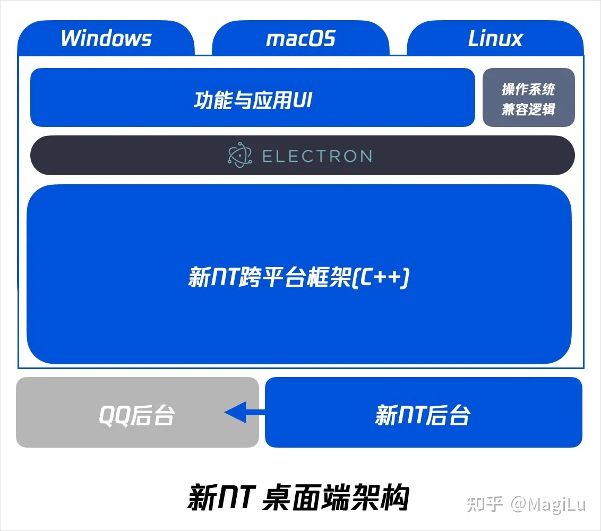
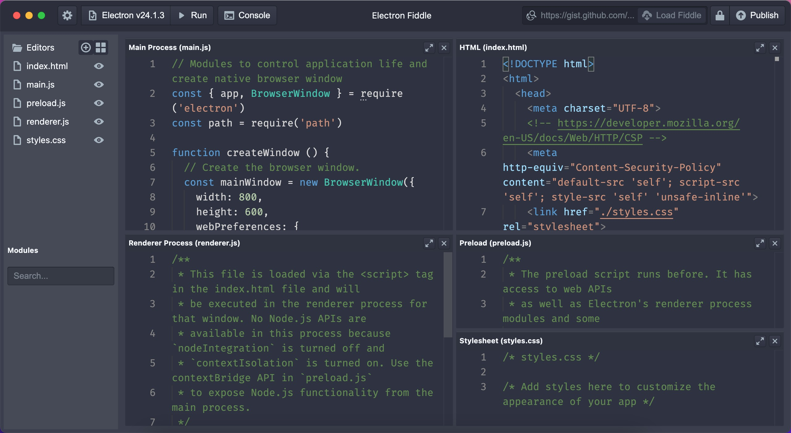
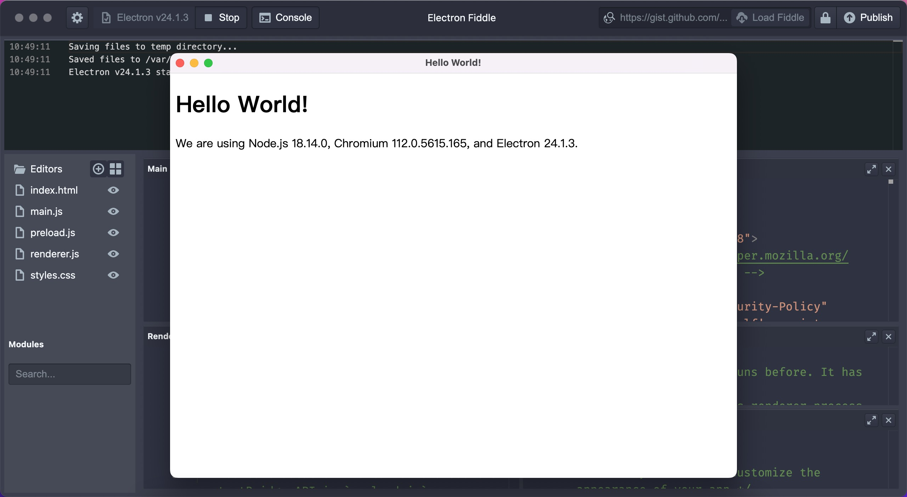
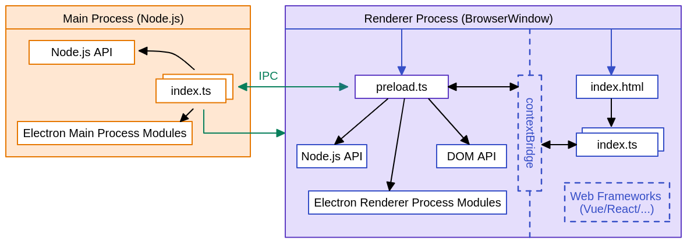

## Electron 学习指导

### 一、开始上手

> 在这一小节对 Eelectron 有个大概的了解

#### 1.1 介绍

**Electron**（原名为**Atom Shell**）是 **GitHub** 开发的一个开源框架。它通过使用 **Node.js** 和 **Chromium** 的渲染引擎完成**跨平台的桌面** GUI 应用程序的开发。Electron 现已被多个开源 Web 应用程序用于前端与后端的开发，著名项目包括 GitHub 的 Atom 、微软的 Visual Studio Code 和腾讯的 QQNT。

**Electron** 并不是一门新的技术，自 2013 年开始至今已有 10 年历史了，最初是由 GitHub 团队开发，现由 OpenJS 基金会负责维护。


[腾讯基于 Electron 技术的 Windows 版 QQ 内测版本预计 2023 年推出，该版本有哪些新功能？](https://www.zhihu.com/question/570447541/answer/2791939780?utm_id=0)



**以上内容仅需有个印象即可，主旨意思就是 Elelectron 很牛！！！！**

#### 1.2 快速体验

**Electron Fiddle** 是 [Electron 官方](https://www.electronjs.org/zh/)提供的快速演示或体验 Electron 功能的工具，在 Electron Fiddle 内部集成了 Electron 的开发环境。通过该工具可以让开发者快速体验 Electron 的某些新特性，对于初学者来说可以快速建立对 Electron 的认识。

1. 安装 Electron Fiddle

Electron Fiddle [下载地址](https://www.electronjs.org/zh/fiddle)，下载符合各自操作系统的版本，正常安装即可。



打开 Electron Fiddle 后可以看到自动创建了 Electron 项目的模板，左侧是文件列表，右侧是文件的内容，可以简单的看到 **Electron 的项目代码是由 HTML、CSS、JavaScript 构成。**

2. 运行 Electron 项目

点击 Electron Fiddle 工具栏中的 【Run】按钮：



3. 修改 Electron 项目代码

- index.html 是项目的布局结构
- style.css 是项目布局样式
- renderer.js 是运行在浏览器环境
- preload.js 是运行在浏览器环境
- main.js 是运行在 Node 环境

关于 proload.js 和 main.js 的作用在后面会详细介绍，当前需要体会到 index.html、style.css 和 renderer.js 的作用。

注：默认情况下每次打开 Electron Fiddle 都会重新的生成项目模板，代码模板可以以链接形式进行分享。

**上面的内容的主旨内容是要知道 Electron 项目的代码使用的是 HTML、CSS、JavasScript 和 Node.js 相关的技术。**

#### 1.3 从零开始

从零开始带大家创建一个 Electron 的项目，让大家对 Electron 的技术架构有个基本的认识。

1. 项目结构，Electron 项目至少需要 3 个文件
   - index.html
   - package.json（npm init -y）
   - main.js （习惯叫做 main.js）

创建一个空白的目录，然后分别创建上述 3 个文件

2. 安装 electron 依赖：

```bash
# 安装 electron
npm install electron --save-dev
```

注：在安装 electron 的过程中会根据开发者的当前的操作系统去下载 electron 的二进制包，多数情况下由于网络的原因会导致下载失败，对应的解决方案是指定国内的镜像，如[淘宝镜像](https://npmmirror.com/)。

```bash
# 指定 npm 仓库地址
npm config set registry https://registry.npmmirror.com
# 指定 electron 二进制包的镜像地址
npm config set ELECTRON_MIRROR="https://npmmirror.com/mirrors/electron/"
```

检测 npm 仓库和 electron 镜像地址是否设置成功

```bash
npm config list
```


3. 启动项目

通过安装好的 electron 来启动项目，添加启动项目的脚本：

```json
{
	...
  "scripts": {
    "start": "electron ."
  },
  ...
}

```

在执行 `npm start` 时，electron 会去执行 `package.json` 中指定的入口：

```json
{
  "name": "electron-demo",
  "version": "1.0.0",
  "description": "",
  "main": "main.js",
  "scripts": {
    "start": "electron .",
    "test": "echo \"Error: no test specified\" && exit 1"
  },
  "keywords": [],
  "author": "",
  "license": "ISC",
  "devDependencies": {
    "electron": "^24.3.0"
  }
}
```

4. 开始编码

在 main.js 中启动一个应用窗口并加载 index.html 页面：

```javascript
// main.js
const { app, BrowserWindow } = require("electron");

function createWindow() {
  // 应用窗口实例
  const win = new BrowserWindow();
  // 加载 index.html
  win.loadFile("./index.html");
}

// 监听 app 的 ready 事件（生命周期）
app.on("ready", () => {
  createWindow();
});
```

至此最基本的 Electron 项目就创建好了。

### 二、基本概念

> 在这一小节对 Eelectron 的技术架构有个基本的认识

Electron 是内部集成了两个运行环境：

- Nodejs 环境，称为主进程（ Main Process ）
- Chromium 环境，称为渲染器进程（Renderer Process）



可以理解成在主进程中就是在写 Nodejs 的代码，在渲染器进程中是在写网页相关的代码（如 HTML、CSS、JavaScript 等）。

**主进程**对应的代码文件是 `main.js` 以及将来通过 `require` 导入到 `main.js` 中的模块

**渲染器进程**对应的代码文件是 `index.html` 以及将来通过 `link`、`script` 、`img`引入到页面中的代码或资源

#### 2.1 主进程

主进程是运行在 Nodejs 环境中的，因此可以调用 Nodejs 的各个 API，如 `http`、`path`、`url`、`file` 等系统模块，也可以在导入 Electron 后使用 Electron 模块提供的 API。

先介绍 Electron 中 `app`、`BroswerWindow` 的基本用法：

```javascript
// 导入相应的功能接口
const { app, BrowserWindow } = require("electron");
function createWindow() {
  // 创建应用窗口实例
  const win = new BrowserWindow({
    width: 1200,
    height: 800,
    titleBarStyle: "hidden",
    titleBarOverlay: true,
  });
  // 加载 index.html
  win.loadFile("index.html");
  // 加载网络地址
  // win.loadURL('http://static-serve.botue.com/electron/index.html')
}
// 监听 app 的 ready 事件（生命周期）
app.on("ready", () => {
  createWindow();
});
// 监听 app 的 activate 事件
app.on("activate", () => {
  console.log("Electron 应用被激活了...");
});
```

- BroswerWindow 用来创建并按制浏览器窗口
  - width/heigh 指定窗口的大小
  - titleBarStyle 窗口标题栏样式
  - titleBarOverlay 定义 windows 的标题栏
  - loadFile 实例方法，加载本地 html 文件
  - loadURL 实例方法，加载网络地址
- app 控制应用程序的事件生命周期
  - ready 在 Electron 完成初始化时触发该生命周期
  - active 在 Eelectron 被激活（前台运行）时触发该生命周期

注：修改了主进程的代码后需要重新启动应用。

#### 2.2 渲染器进程

在对上述的概念有了基本印象后，我们来相对大家比较熟悉的渲染器进程：

```html
<!DOCTYPE html>
<html lang="en">
  <head>
    <meta charset="UTF-8" />
    <meta http-equiv="X-UA-Compatible" content="IE=edge" />
    <meta name="viewport" content="width=device-width, initial-scale=1.0" />
    <title>Hello World!</title>
    <link rel="stylesheet" href="./style.css" />
  </head>
  <body>
    <h1 class="message">Hello World!</h1>
    <button class="button">打个招呼</button>
    <script src="./renderer.js"></script>
  </body>
</html>
```

在 `index.html` 中引入了 `style.css` 和 `renderer.js` 两个文件

```css
/** style.css **/
body {
  padding: 10px 20px;
}
h1 {
  font-size: 36px;
  color: #333;
}
button {
  height: 36px;
  padding: 0 15px;
  border-radius: 4px;
  cursor: pointer;
  background-color: #42b883;
  color: #fff;
  border: none;
}
button:active,
button:hover {
  background-color: #33a06f;
}
```

```javascript
// renderer.js
// 获取 DOM 节点
const button = document.querySelector(".button");
const message = document.querySelector(".message");
// 监听用户点击事件
button.addEventListener("click", () => {
  // 修改 DOM 的内容
  message.innerHTML = "大家好，快来黑马学IT!";
});
```

注：修改了渲染器进程的代码后使用快捷键 Commond + R 或者 Ctrl + R 刷新页面。

#### 2.3 预加载脚本

主进程与渲染进程之间是彼此隔离的，相互之间无法直接进行通信，通过**预加载脚本**能够实现主进程与渲染进程间的通信，预加载脚本本质上就是一个 `.js` 文件，在创建应用窗口时指定：

```javascript
// 导入相应的功能接口
const { app, BrowserWindow } = require("electron");
function createWindow() {
  // 创建应用窗口实例
  const win = new BrowserWindow({
    width: 1200,
    height: 800,
    titleBarStyle: "hidden",
    titleBarOverlay: true,
    webPreferences: {
      preload: "./preload.js",
    },
  });
  // 加载 index.html
  win.loadFile("index.html");
}
```

预加载脚本可以实现两个常用的功能：

1. 扩展 window 对象，为其添加一些属性或方法

```javascript
// preload.js
const { contextBridge } = require("electron");
// 为 window 扩展了 test 属性
contextBridge.exposeInMainWorld("test", "window.test");
// 为 window 扩展一些属性或方法
contextBridge.exposeInMainWorld("electronAPI", {
  // 平台的名称
  platform: process.platform,
  // 系统版本号
  getVersions() {
    return process.versions;
  },
});
```

2. 进程间通信

由渲染进程向主进程发起通信的实现步骤如下：

- ipcMain 处理主进程的通信，通过 `handle` 定义一个处理方法

```javascript
// main.js
// 导入相应的功能接口
const { app, BrowserWindow, ipcMain } = require("electron");

// 省略之前完成的代码...

// 注册一个名称 handle-message 处理方法
ipMain.handle("handle-message", (_ev, message) => {
  console.log("I have received your message: " + message);
  // 将处理结果返回给渲染进程
  return "Hi, your message is: " + message;
});
```

- ipcRender 处理渲染器进程的通信，通过 `invoke` 调用主进程定义好的处理方法

```javascript
// preload.js
const { contextBridge, ipcRenderer } = require("electron");
// 为 window 扩展一些属性或方法
contextBridge.exposeInMainWorld("electronAPI", {
  // ...
  // 发送用户的消息
  sendMessage(message) {
    // 调用主进程中的方法并传参
    return ipcRenderer.invoke("handle-message", message);
  },
});
```

```javascript
// renderer.js
// 获取 DOM 节点
const button = document.querySelector(".button");
const message = document.querySelector(".message");
// 监听用户点击事件
button.addEventListener("click", async () => {
  // 修改 DOM 的内容
  message.innerHTML = "大家好，快来黑马学编程...";
  // 获取主进程处理的结果
  const result = await window.electronAPI.sendMessage("测试消息发送...");
});
```

#### 2.4 打包应用

当所有功能开完成毕后，将 Electron 打包成不同平台的应用，Electron 提供了打包的工具 [Electron Forge](https://www.electronforge.io/)，但实际应用中大家用的比较多的是 [electron-builder](https://www.electron.build/)，接下来我们介绍的是 electron-builder 的使用：

1. 安装 electron-builder

   ```bash
   npm install electron-builder --save-dev
   ```

2. 配置脚本

   ```json
   {
     ...
     "scripts": {
       "start": "electron .",
       "build:mac": "electron-builder --mac",
       "build:win": "electron-builder --win"
     },
     ...
   }
   ```

3. 生成图标

   在项目根目录中创建 `build` 目录，再准备一张 png 格式的图片，将其命名为 `icon.png` 放到 `build`中，关于图标的详细说明[参见文档](https://www.electron.build/icons)。

4. 执行打包任务

   ```bash
   # 打包 mac 系统的应用
   npm run build:mac
   # 或打包 windows 系统的应用
   npm run build:win
   ```

   在打包的过程中需要下载相应平台的工具包，因此需要稳定的网络环境，大家要耐心待待。

   **注：Windows 系统开发时不能打包 Mac 的应用。**

### 三、项目开发

> 在这一小节掌握 Electron 整合前端框架来进行开发

通过学习我们了解了 Electron 中是可以运行前端项目的，因此完全可以使用 Vue、React、jQuery 等开发 Electron 项目，接下来我们选择使用 Vue 来实现发送消息的功能。

#### 3.1 创建项目

[社区](https://www.electronjs.org/zh/docs/latest/tutorial/boilerplates-and-clis)有许多整合了 Vue、React 和 Electron 的工具或模板，在这里我们来使用 [electron-vite](https://cn-evite.netlify.app/) 来创建项目：

```bash
# 引导式创建项目
npm create @quick-start/electron
```

```bash
✔ Project name: … <electron-app>
✔ Select a framework: › vue
✔ Add TypeScript? … No / Yes
✔ Add Electron updater plugin? … No / Yes
✔ Enable Electron download mirror proxy? … No / Yes

Scaffolding project in ./<electron-app>...
Done.
```

项目创建好后用 VS Code 打开，然后安装依赖：

```bash
npm install
```

依赖安装完毕后启动项目

```
npm run dev
```

启动项目后修改渲染进程会自动启用了 HMR，即自动刷新页面，但要主进程进行热重载（重启项目）需要添加 `--watch ` 参数：

```json
{
  ...
  "scripts": {
    "dev": "electron-vite dev --watch",
  }
  ...
}
```

#### 3.2 项目结构

使用 electron-vite 创建的 Vue 项目，已经规划好了目录的结构，重点来看 `src` 目录：

```
├──build
├──src/
│  ├──main
│  ├──preload
│  └──renderer
├──electron.vite.config.js
└──package.json
```

- `main` 目录对应的是主进程的代码
- `renderer` 目录对应的是渲染进程的代码，即 Vue 的组件
- `preload` 目录对应的是预加脚本的代码

1. 设置标题栏

```javascript
// src/main/index.js
// ...
function createWindow() {
  new BroswerWindow({
    // ...
    titleBarStyle: "hidden",
    titleBarOverlay: true,
    // ...
  });
}
```

2. 获取平台名称

```javascript
// src/proload/index.js
import { contextBridge } from "electron";
// 暴露一些属性或方法
contextBridge.exposeInMainWorld("electronAPI", {
  platform: process.platform,
});
```

3. 将静态模板整合到项目中
   - 将原来的 `assets` 目录替换掉
   - 将 html 结构放到 `App.vue` 的 `template` 中
   - 将 `style.css` 重命名为 `style.less` 导入到 `App.vue` 的 `style` 中

注：由于安全的策略限制在打包应用时字体图标无法正常工作，需要在 `index.html` 做以下调整：

```html
<!-- src/index.html -->
<!DOCTYPE html>
<html>
  <head>
    <meta charset="UTF-8" />
    <title>Electron</title>
    <!-- https://developer.mozilla.org/en-US/docs/Web/HTTP/CSP -->
    <meta
      http-equiv="Content-Security-Policy"
      content="default-src 'self'; script-src 'self'; style-src 'self' 'unsafe-inline'; font-src 'self' data:"
    />
  </head>
  <body>
    <div id="app"></div>
    <script type="module" src="/src/main.js"></script>
  </body>
</html>
```

#### 3.3 功能逻辑

详见课堂代码

#### 3.3 打包应用

将准备好的图片放到 `build` 目录中，然后 `npm run build:mac` 或 `npm run build:win`
